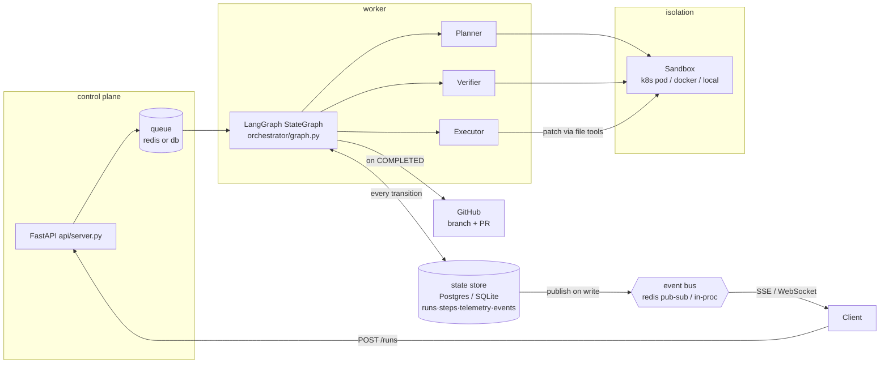
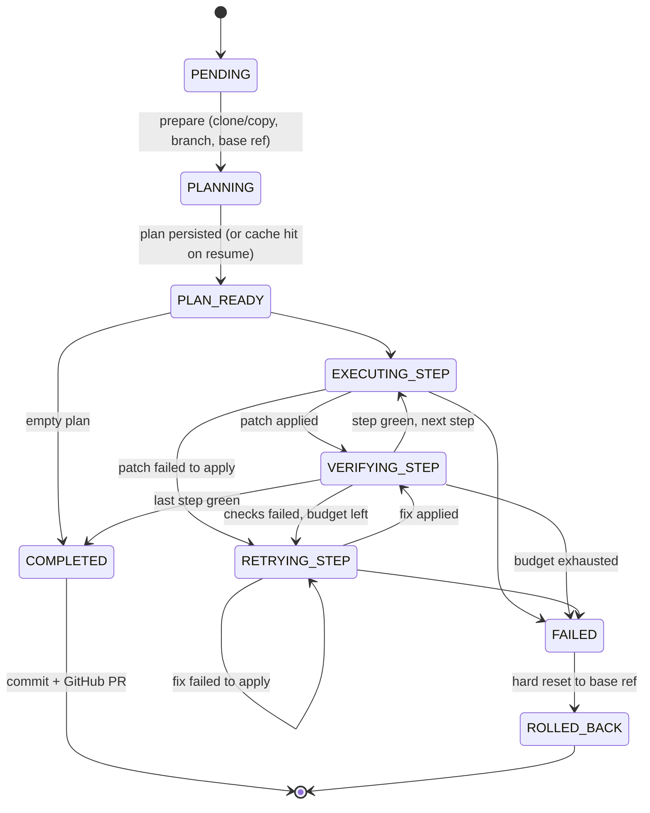

# Architecture

This document walks one run through the system end-to-end, then covers the
components, the failure modes, and the security model. Decision rationale
lives in [docs/adr/](adr/) — each section links the ADR that justifies it.

## System overview

## Life of a run

`POST /runs {repo, task}` (or `python3 -m src.main run …`) persists a
`PENDING` run and enqueues its id. A worker claims it (atomic conditional
UPDATE — two workers cannot both win) and the orchestration engine drives it.
The engine is a **LangGraph StateGraph** ([ADR 0001](adr/0001-langgraph-orchestration.md)):
nodes below, edges routed on the **persisted** status after every node.

1. **prepare** — `RepoManager.prepare` clones the URL (`--depth 1`) or copies
   a local path, captures the **base ref** (rollback/diff anchor), and
   checks out the run branch. Remote URLs mark the run **untrusted** for
   sandbox selection ([ADR 0004](adr/0004-sandbox-tiers.md)).
2. **plan** — the Planner (read-only) lists the tree, builds the **static
   import-dependency graph** ([ADR 0005](adr/0005-dependency-graph-planning.md)),
   reads the most relevant snippets (ranked by task-keyword hits and
   dependents-centrality), and asks the LLM for a strict-JSON plan. Steps are
   validated into typed rows, `depends_on` is checked against the plan, and
   the final order is **topologically sorted** (declared edges ∪ import
   edges) so dependencies are edited before dependents. The plan is cached on
   the run row; resume never re-plans ([ADR 0008](adr/0008-state-store-as-source-of-truth.md)).
3. **execute** — the Executor applies ONE step as a **patch**: ordered,
   exact, unique search/replace edits through traversal-guarded file tools
   ([ADR 0003](adr/0003-patch-based-edits.md)). Whole-file content is allowed
   only for `create`. A patch that doesn't apply becomes structured
   `last_error` state and consumes a retry — the model corrects its anchor on
   the next iteration.
4. **verify** — the Verifier runs the step's check commands (the repo's own
   tests/linters) **inside the sandbox** with a wall-clock timeout. On
   failure it captures exit code + stdout/stderr tails into the error blob
   that becomes the Executor's retry context. Pass ⇒ next step; fail with
   budget ⇒ `RETRYING_STEP`; budget exhausted ⇒ `FAILED`.
5. **rollback / finalize** — `FAILED` hard-resets the workspace to the base
   ref (`ROLLED_BACK`): no partial edits survive. `COMPLETED` commits the
   branch and **opens the GitHub PR** (push with env-based token auth, REST
   create, idempotent; [ADR 0006](adr/0006-github-pr-creation.md)).

Throughout, every agent invocation writes a telemetry span (tokens, duration,
iteration, status) and every transition writes an event row that is **also
pushed** to live SSE/WebSocket subscribers ([ADR 0002](adr/0002-push-streaming.md)).

## Failure modes and what handles them

| Failure | Handling |
|---|---|
| Worker dies mid-step (SIGKILL, eviction) | Last transition already committed; startup `recover()` re-drives every non-terminal run; LangGraph's conditional entry resumes at the persisted phase; plan cache prevents re-planning; completed steps skipped. |
| Patch anchor stale/ambiguous | Recoverable `ExecError` → `last_error` → retry with the failure in context. |
| Checks fail repeatedly | Retry budget (`HARNESS_MAX_RETRIES`) → `FAILED` → hard rollback to base ref. |
| Token spend runaway | Per-run budget summed from spans between steps → `FAILED` → rollback. |
| Hung test command | In-sandbox `timeout` + (local) process-group kill. |
| Queue message lost | DB is the queue of record; startup scan re-finds the run. |
| Pub/sub message lost | Events table is the durable log; SSE merges a catch-up read. |
| PR creation fails | `ERROR` event, run stays `COMPLETED`; re-trigger via CLI/API. |
| Disk growth | Retention sweep: workspace TTL, record purge, orphan reaping ([ADR 0007](adr/0007-retention-policy.md)). |
| Two workers claim one run | Atomic conditional UPDATE; loser polls again. |

## Security model

Two untrusted inputs: **repo code** (tests/lint execute arbitrary commands)
and **model output** (edits). Full analysis in [ADR 0004](adr/0004-sandbox-tiers.md).

* Edits: every file op resolves inside the workspace root (traversal guard);
  ambiguous search/replace is rejected.
* Repo code: k8s pod-per-run (non-root, caps dropped, read-only rootfs, no
  SA token, deny-all NetworkPolicy, optional gVisor) ▸ docker
  container-per-run (`--network none`, read-only rootfs, resource caps) ▸
  local subprocess (scrubbed env, process-group kill, ulimits) — **local is
  refused for remote-URL repos unless explicitly allowed**
  (`HARNESS_ALLOW_LOCAL_UNTRUSTED=1`).
* Secrets: never enter any sandbox env; the GitHub push token rides in
  `GIT_CONFIG_*` env vars, not argv or stored remotes.
* Tenancy: one workspace, one sandbox, one branch per `run_id`; no shared
  volumes.

## Deployment topology

`infra/docker-compose.yml` runs api + N workers + Postgres + Redis on one
host. `infra/k8s/` is the cluster blueprint: stateless API Deployment,
worker Deployment (RBAC-scoped to sandbox pods + exec in-namespace,
`HARNESS_SANDBOX=k8s`), Postgres/Redis, deny-all sandbox NetworkPolicy,
gVisor RuntimeClass, and the daily cleanup CronJob. Workers scale
horizontally (KEDA on Redis queue depth); crash safety at scale is the same
startup `recover()` every worker already runs.

## Source map

| Concern | Where |
|---|---|
| Orchestration engines | `src/orchestrator/graph.py` (LangGraph), `state_machine.py` (stages + builtin driver), `states.py` (transition rules) |
| Agents | `src/orchestrator/planner.py`, `executor.py`, `verifier.py` |
| Dependency analysis | `src/analysis/dep_graph.py` |
| Sandboxes | `src/sandbox/{k8s_runner,docker_runner,local_runner,base,file_tools}.py` |
| State store | `src/storage/{db,models}.py` |
| Streaming | `src/events.py`, SSE/WS in `src/api/server.py` |
| GitHub | `src/git/github.py`, `src/git/repo_manager.py` |
| Retention | `src/retention.py` |
| Telemetry | `src/telemetry/tracing.py` |
| Control plane | `src/api/server.py`, `src/worker.py`, `src/queue.py`, `src/main.py` |
